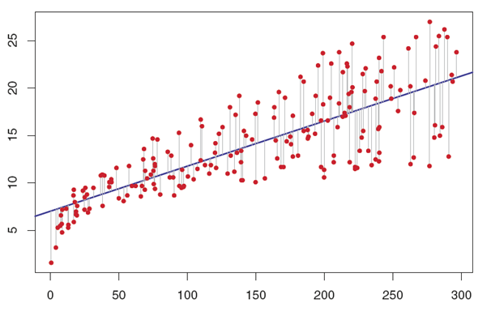

**Note:**

-An R Notebook is an R Markdown document with chunks that can be executed independently and interactively, with output visible immediately beneath the input.

-Notebook output are available as HTML, PDF, Word, or Latex. 

-This Notebook as HTML is preferably open with Google Chrome.

-R-Code can be extracted as Rmd file under the button "Code" in the notebook.

-This Notebook using iterative development. It means the process starts with a simple implementation of a small set of idea requirements and iteratively enhances the evolving versions until the complete version is implemented and perfect.

____________

#World of Regression

> The relationships among variables. 
> Used for predictive modeling and data mining tasks.

>The word “Regression” came into existence due to “Sir Francis Galton”. 
There are more than 10 types of regression algorithms designed for various types of analysis. Each type has its own significance. Every analyst must know which form of regression to use depending on type of data and distribution.

> Lets take a simple example : We are a small company that sell milktea. There can be a hundred of factors that affects our sales. In our case, sales is your dependent variable. Factors affecting sales are independent variables. 

>It helps us to answer the following questions:

* Which of the factors have a significant impact on sales
* Which is the most important factors for sales
* How do the factors interact with each other
* What would be the annual sales ot the next year

#Type of Regression:

#1. Linear Regression

#2. Polynomial Regression

#3. Logistic Regression

#4. Quantile Regression

#5. Ridge Regression

#6. Lasso Regression

#7. ElasticNet Regression

#8. Principal Component Regression

#9. Partial Least Square Regression

#10. Support Vector Regression

#11. Ordinal Regression

#12. Poisson Regression

#13. Negative Binomial Regression

#14. Quasi-Poisson Regression

#15. Cox Regression

#Change log update

* 29.01.2019

 

#Preferences

* [R for Data Science](https://r4ds.had.co.nz/)
* [KDnuggets](https://www.kdnuggets.com/)
* [George A. Smathers Libraries](https://guides.uflib.ufl.edu/precisionpublichealth/tidy_messy)
* [Journal of Statistical Software](https://www.jstatsoft.org/index)
* [An introduction to data cleaning with R](https://cran.r-project.org/doc/contrib/de_Jonge+van_der_Loo-Introduction_to_data_cleaning_with_R.pdf)
* [Tutorialspoint](https://www.tutorialspoint.com/r/index.htm)
* [DataCamp](https://www.datacamp.com/)
* [Software carpentry](https://software-carpentry.org/lessons/index.html)
* [UC Business Analytics R Programming Guide ](http://uc-r.github.io/)
* [Datanovia](https://www.datanovia.com/en/lessons/identify-and-remove-duplicate-data-in-r/)
* [R-bloggers](https://www.r-bloggers.com/)
* [R-statistics.co](http://r-statistics.co/)
* [Datascience+](https://datascienceplus.com/)

#License

[MIT](https://opensource.org/licenses/MIT)

